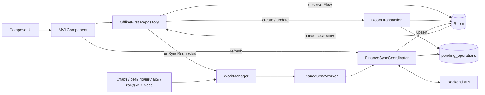
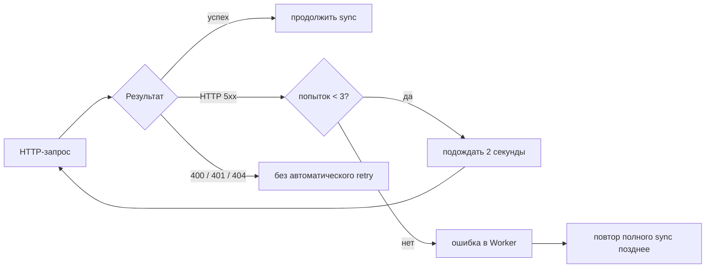

# РИД.МИ

## Архитектура

Проект разделён на feature-модули для экранов, финансовый
контракт `:finance:api`, реализации финансового контракта в `:finance:impl` и общие UI- и
design-system модули. 
Presentation-слой построен на MVI, а зависимости собираются вручную в `:app`.

Полное описание модулей, правил зависимостей итд находится в [arch.md](arch.md).

[GitHub Project](https://github.com/users/zagir005/projects/3) - тут веду учет по задачкам.

## Offline-first

Room — единственный источник данных для UI. Сеть используется только
синхронизатором: ответ backend сначала записывается в Room, после чего новые
данные приходят на экраны через `Flow`.



### Локальная запись

`Save → Room-транзакция (сущность + outbox) → Flow обновляет UI → WorkManager
отправляет outbox`. Поэтому результат виден сразу, даже без сети. Client ID
остаётся стабильным после получения remote ID, а транзакция нового счёта ждёт
его синхронизации.

### Карта проверки требований ДЗ

| Пункт ДЗ | Как реализован | Где смотреть |
|---|---|---|
| Просмотр данных без сети | Все экраны наблюдают Room через offline-first репозитории | [`FinanceDatabase`](finance/impl/src/main/kotlin/com/zagirlek/finance/impl/local/FinanceDatabase.kt), [`OfflineFirstTransactionsRepository`](finance/impl/src/main/kotlin/com/zagirlek/finance/impl/transaction/OfflineFirstTransactionsRepository.kt), [`DefaultAnalyticsComponent`](feature/analytics/src/main/kotlin/com/zagirlek/analytics/DefaultAnalyticsComponent.kt) |
| Список обновляется после create/update | Локальная команда изменяет Room, новый список приходит через `Flow` | [`RoomAccountsCommandHandler`](finance/impl/src/main/kotlin/com/zagirlek/finance/impl/account/RoomAccountsCommandHandler.kt), [`RoomTransactionsCommandHandler`](finance/impl/src/main/kotlin/com/zagirlek/finance/impl/transaction/RoomTransactionsCommandHandler.kt) |
| Создание в offline | Сущность и pending-операция сохраняются одной Room-транзакцией | [`PendingOperationEntity`](finance/impl/src/main/kotlin/com/zagirlek/finance/impl/local/sync/PendingOperationEntity.kt), [`OutboxDelivery`](finance/impl/src/main/kotlin/com/zagirlek/finance/impl/sync/OutboxDelivery.kt) |
| Синхронизация с backend | Outbox отправляется до обновления категорий, счетов и истории; запуск защищён `Mutex` | [`FinanceSyncCoordinator`](finance/impl/src/main/kotlin/com/zagirlek/finance/impl/FinanceSyncCoordinator.kt), [`TransactionsReadSynchronizer`](finance/impl/src/main/kotlin/com/zagirlek/finance/impl/transaction/TransactionsReadSynchronizer.kt) |
| Синхронизация при появлении сети | Network callback ставит уникальную immediate work | [`AndroidNetworkMonitor`](app/src/main/java/com/zagirlek/ya_money/connectivity/NetworkMonitor.kt), [`FinanceWorkScheduler`](app/src/main/java/com/zagirlek/ya_money/sync/FinanceWorkScheduler.kt) |
| Периодическая синхронизация | Unique WorkManager-задача раз в 2 часа, только при `CONNECTED` | [`FinanceWorkScheduler`](app/src/main/java/com/zagirlek/ya_money/sync/FinanceWorkScheduler.kt), [`FinanceSyncWorker`](app/src/main/java/com/zagirlek/ya_money/sync/FinanceSyncWorker.kt) |
| Ошибки и состояние сети в UI | Offline-баннер; ошибка refresh не скрывает кэш | [`AppStatusBanner`](app/src/main/java/com/zagirlek/ya_money/navigation/AppStatusBanner.kt), [`TransactionsScreen`](feature/transactions/src/main/kotlin/com/zagirlek/transactions/TransactionsScreen.kt), [`AccountsScreen`](feature/accounts/src/main/kotlin/com/zagirlek/accounts/AccountsScreen.kt), [`AnalyticsScreen`](feature/analytics/src/main/kotlin/com/zagirlek/analytics/AnalyticsScreen.kt) |
| Три повтора HTTP 5xx | Три попытки с паузой 2 секунды для чтения и outbox-запросов | [`ServerRetryPolicy`](finance/impl/src/main/kotlin/com/zagirlek/finance/impl/sync/ServerRetryPolicy.kt), [`OutboxDelivery`](finance/impl/src/main/kotlin/com/zagirlek/finance/impl/sync/OutboxDelivery.kt) |

### Повтор запросов



[`ServerRetryPolicy`](finance/impl/src/main/kotlin/com/zagirlek/finance/impl/sync/ServerRetryPolicy.kt)
задаёт три попытки с интервалом 2 секунды для загрузки данных.
[`OutboxDelivery`](finance/impl/src/main/kotlin/com/zagirlek/finance/impl/sync/OutboxDelivery.kt)
применяет ту же политику к create/update. Неоднозначный результат `POST`
повторно вслепую не отправляется: операция получает `UNKNOWN_RESULT` и сначала
сверяется с backend.

## Стек

- Kotlin
- Jetpack Compose
- Decompose
- Coroutines и Flow
- Ручной DI

## API-ключ

Для запросов к Shmr Finance API создай файл `local.properties` в
корне проекта и добавь в него:

```properties
financeApiToken=ваш_токен
```
