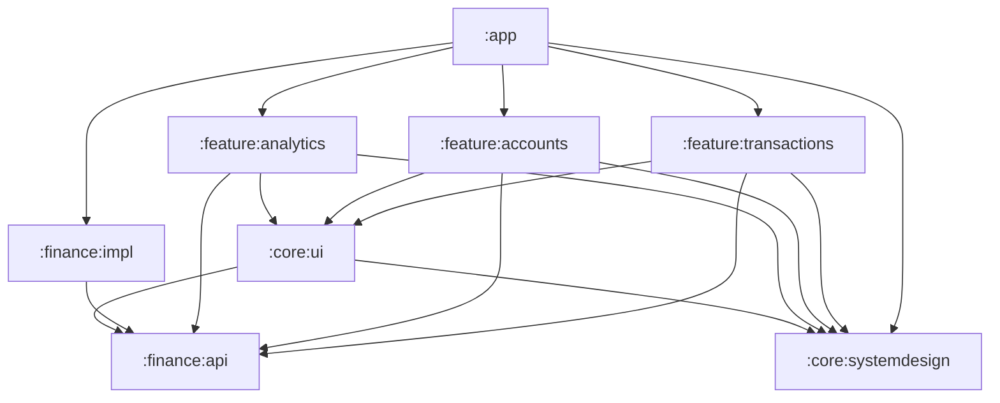
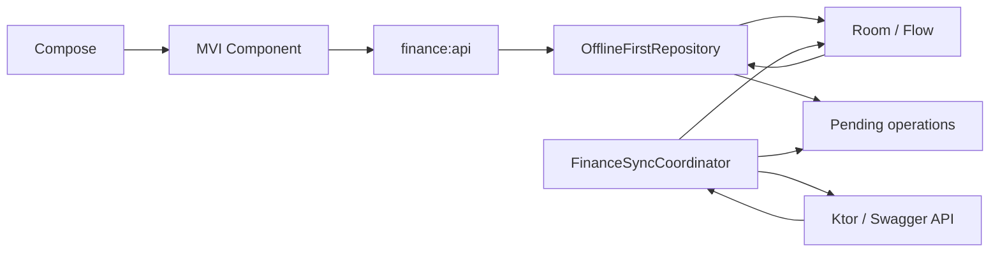
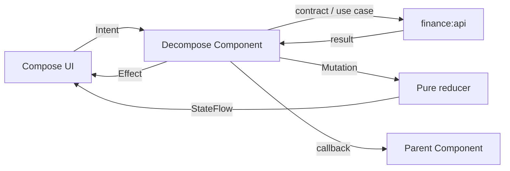

# Архитектура Ya Money

`arch.md` — архитектурный контракт проекта. Любое изменение модульных границ,
направления зависимостей, DI, навигации, MVI или слоёв данных сначала отражается
здесь с причиной решения, а затем в коде.

## 1. Текущий scope

Текущая итерация приложения — ДЗ3. Она завершает основной финансовый сценарий:

1. списки расходов и доходов;
2. список счетов;
3. аналитика с историей и фильтрами;
4. добавление и редактирование расхода или дохода;
5. добавление и редактирование счёта, включая баланс;
6. просмотр ранее загруженных данных и создание операций без сети;
7. синхронизация локальных изменений при появлении сети и периодически через
   WorkManager.

Room является локальным source of truth. Сеть больше не является источником
данных для UI: remote-ответы и локальные изменения сначала записываются в Room,
после чего экраны получают обновлённые domain-модели через `Flow`.

Настройки, PIN и биометрия по-прежнему не входят в scope.

Сейчас поддерживается только светлая тема. `MainActivity` зафиксирована в
portrait-ориентации; landscape-layout и тёмная палитра появятся отдельными
изменениями, когда для них появятся макеты и сценарии.

## 2. Принципы и стек

- UI — Jetpack Compose.
- Навигация и lifecycle экранных компонентов — Decompose.
- Presentation построен на собственном минимальном MVI runtime поверх
  Coroutines и Flow.
- DI пока ручной и явный. Composition root находится в `:app`.
- Разработка идёт вертикальными срезами: контракт → fake-данные → MVI Component → UI,
  а не последовательным созданием всех data-, domain- и UI-слоёв.
- Расходы и доходы — два режима одной feature `:feature:transactions`,
  параметризованной `TransactionType`.
- Список счетов — самостоятельная feature `:feature:accounts`.
- Сеть реализуется внутри `:finance:impl`: HTTP-клиент, DTO, mapper-ы и
  remote data source не пересекают границу этого модуля.
- На этапе ДЗ3 используется offline-first: Room — source of truth, remote API —
  источник синхронизации, а локальная очередь хранит ожидающие отправки
  изменения.
- Повторно используется визуальный каркас, но не один `HomeStore` для
  транзакций и счетов.

## 3. Модули



### `:app`

Точка входа и composition root:

- `Application`, `MainActivity` и Android manifest;
- корневая тема;
- ручной `AppDependencies`;
- `RootComponent` и `MainComponent`;
- конфигурация WorkManager, `WorkerFactory` и `FinanceSyncWorker`;
- наблюдение за валидированным системным соединением через
  `ConnectivityManager.NetworkCallback`;
- запуск синхронизации при старте приложения и постановка уникальной
  периодической работы;
- связывание concrete-реализаций из `:finance:impl` с интерфейсами из
  `:finance:api`.

`FinanceSyncWorker` не содержит алгоритм синхронизации: он вызывает
`FinanceSyncCoordinator` из `:finance:impl`. В `:app` нет бизнес-логики, DTO,
Entity, DAO и реализации отдельной feature.

### `:finance:api`

Публичный Kotlin-контракт предметной области финансов. Это **не** HTTP API и не
модуль с Ktor endpoint-ами.

Содержимое:

- доменные сущности и value objects: `Money`, `CurrencyCode`, `Account`,
  `Category`, `Transaction`, типизированные ID и `TransactionType`;
- интерфейсы репозиториев;
- доменные ошибки;
- use case только для операций с собственным правилом или несколькими
  репозиториями.

Модуль не зависит от Android SDK, Compose, Decompose, DI-фреймворков, Ktor, Room и
feature-модулей. Он собран как Kotlin/JVM-модуль: не содержит Android manifest,
Android-зависимости и инструментальные Android-тесты.

Репозитории группируются по устойчивому предметному контракту, а не по экрану:
`TransactionsRepository`, `AccountsRepository`, `CategoriesRepository`. Их
методы чтения возвращают `Flow`: конкретная реализация наблюдает Room, но
контракт не раскрывает способ хранения. Запись выражается domain-командами
`CreateTransaction`, `UpdateTransaction`, `CreateAccount`,
`UpdateAccount`. Обновление счёта содержит полный баланс и валюту, потому что
backend принимает только полный `AccountUpdateRequest`.

Локально созданная сущность получает стабильный client ID до ответа сервера.
Domain ID не предполагает, что значение уже является серверным integer ID.
Связь client ID с remote ID остаётся деталью `:finance:impl`.

Для объединённой истории используется `TransactionsRepository.observe(period)`,
а не отдельные запросы расходов и доходов в аналитической feature. Тип операции
сохраняется в общей domain-модели `Transaction`; расходы и доходы являются
фильтрами одной коллекции.

### `:finance:impl`

Скрывает способы получения и сохранения финансовых данных за контрактами
`:finance:api`.

Содержимое:

- `OfflineFirstAccountsRepository`, `OfflineFirstTransactionsRepository` и
  `OfflineFirstCategoriesRepository`;
- Room database, финансовые Entity, DAO, converters и local data source;
- remote data source, Ktor HTTP-клиент, финансовые DTO и mapper-ы;
- локальная очередь ожидающих операций;
- `FinanceSyncCoordinator`, выполняющий отправку очереди и обновление кэша;
- fake-репозитории только для preview и изолированных тестов.

DTO, Ktor response, Room Entity, DAO и детали синхронизации не пересекают
границу `:finance:impl`.

`:finance:impl` становится Android library, поскольку владеет Room. Отдельные
`:core:database` и `:core:network` не создаются: сейчас и Room, и HTTP-клиент
обслуживают только финансовый implementation-модуль. Общие core-модули появятся,
если инфраструктура получит второй независимый domain-потребитель.

WorkManager остаётся в `:app`: это механизм запуска. Алгоритм, порядок операций
и политика синхронизации находятся в `:finance:impl`.

### `:core:systemdesign`

Независимая от финансовой области дизайн-система:

- цветовые токены и светлая тема;
- типографика и shapes;
- размеры и отступы;
- generic визуальные примитивы, когда у них появится минимум два потребителя.

Токены хранятся в пакете `foundation`: это базовый уровень дизайн-системы, а не
предметный слой. В нём находятся `FinanceDimensions`, палитра, типографика и
shapes. Пакет не знает о транзакциях, счетах, MVI, навигации и репозиториях.

Для элементов первого scope не допускаются случайные `dp`-литералы в feature:
размеры берутся из `FinanceDimensions`. В нём есть базовая шкала и семантические
токены для экрана, top bar, списка, FAB, bottom navigation, иконок и touch
targets. Новый устойчивый размер сначала добавляется сюда, затем применяется в
компоненте.

### `:core:ui`

Общий UI уровня финансового приложения:

- базовый MVI runtime (`MviComponent`) и контракт (`MviStore`, `MviReducer`);
- stateless layout и финансовые UI-компоненты, только если их уже используют
  минимум две feature;
- `BaseBottomSheet` — общий stateless-контейнер для выбора периода, счетов и
  категорий в аналитике. Он владеет только Material bottom-sheet, handle и
  необязательным заголовком; конкретные sheet-ы владеют своим состоянием,
  списком и обработчиками выбора;
- `SelectionListItem` — stateless-строка выбора для списков категорий, счетов
  и типа операций. Она принимает текст, необязательные emoji/подзаголовок и
  тип индикатора, но не хранит выбранные элементы;
- `UiText`, `UiError`, форматтеры денег и дат для UI.

Модуль может зависеть от `:finance:api` и `:core:systemdesign`, но не загружает
данные, не содержит MVI Component конкретного экрана и не управляет навигацией.

### `:feature:transactions`

Presentation вертикального среза транзакций:

- расход и доход как независимые экземпляры одного `TransactionsComponent`;
- `TransactionEditorComponent` с режимами создания и редактирования;
- форма суммы, категории, даты, времени и счёта по текущему Figma-макету;
- комментарий остаётся частью domain-команды и сохраняется при редактировании,
  но не выводится в форме, пока для него нет состояния и размеров в макете;
- MVI contract, Component, reducer, UI mapper и Compose screen;
- callbacks наружу для открытия редактора и возврата после сохранения.

Вкладки расходов и доходов используют одну реализацию, но у каждой свой
экземпляр Component: сохраняются независимые дата, состояние загрузки и
позиция списка.

### `:feature:accounts`

Presentation вертикального среза счетов:

- `AccountsComponent`, собственный MVI contract, reducer и UI mapper;
- экран списка и общего баланса;
- `AccountEditorComponent` для создания и редактирования баланса, имени, emoji
  и валюты;
- callbacks для переходов к редактору и возврата после сохранения.

Feature может использовать общий stateless layout, но не Component транзакций.

### `:feature:analytics`

Presentation вертикального среза аналитики:

- `AnalyticsComponent`, MVI contract, reducer, UI mapper и Compose-экран;
- получает domain-контракт истории операций, а не DTO или HTTP-клиент;
- хранит период, тип операций, выбранные категории и счета в immutable state;
- различает отсутствие фильтра по статьям и явный пустой выбор: `null` означает
  все доступные статьи, пустое множество — намеренно пустую статистику;
- агрегирует полученные domain-операции по категориям для диаграммы и
  отображает историю от новых операций к старым;
- содержит специализированные stateless-элементы аналитики, включая
  `AnalyticsDonutChart`. Диаграмма принимает подготовленные UI-сегменты, а не
  domain-операции; пока у неё один потребитель, она не переносится в `:core:ui`;
- преобразует загруженную историю в immutable UI-сводку до публикации State:
  применяет выбранные фильтры, считает точную сумму и группирует категории;
- выполняет пересчёт фильтрованной истории, сводки и UI-моделей в `ioScope`;
  на main-поток передаётся только готовая immutable mutation для публикации
  State;
- хранит период, фильтры, полную загруженную историю и счета в immutable
  `AnalyticsState`; Component не держит второй mutable-кэш этих данных;
- публикует в State отдельно доступные варианты категорий и счетов, построенные
  из полной загруженной истории: bottom sheet фильтра остаётся рабочим даже
  если текущая комбинация фильтров не вернула операций;
- формирует presentation-подзаголовок счёта без расширения domain-модели:
  backend не передаёт тип счёта, поэтому для не-наличных счетов используется
  fallback «Дебетовая карта»;
- использует единую UI-модель сводной категории для диаграммы и строки
  детализации. Специфичное рисование полосы прогресса выделено в отдельный
  stateless-компонент рядом с аналитикой;
- открывает детализацию диаграммы только через MVI intent/effect: sheet получает
  уже опубликованную immutable-сводку и не обращается к репозиториям;
- назначает цвет категории детерминированно по её ID через палитру из 30
  оттенков. Цвет не приходит с backend и не зависит от порядка или фильтров;
- открывает выбор периода в два шага через MVI intent/effect: сначала
  `PeriodFilterBottomSheet` с вариантами «Произвольный», неделя, месяц,
  квартал и год, а календарь показывается только после выбора произвольного
  периода;
- использует `CalendarBottomSheet`: он оборачивает системный Material 3
  `DateRangePicker` общим `BaseBottomSheet`, хранит черновой `LocalDate`
  диапазон внутри Compose и передаёт применённые даты в экран через callback;
- переход на экран инициирует `RootComponent` из `:app`.

### Будущие core-модули

`core:common`, `core:network`, `core:database` и `core:security` не создаются
заранее. Room и Ktor пока остаются в `:finance:impl`, потому что у них один
domain-потребитель. Технический core-модуль появляется только со вторым
независимым потребителем:

- `core:common` — маленькие platform-agnostic утилиты, действительно нужные
  нескольким независимым модулям; не место для доменных моделей и репозиториев;
- `core:network` — только transport-инфраструктура Ktor (`HttpClient`, auth
  plugin, serialization, HTTP errors), без DTO и endpoint-методов финансов;
- `core:database` — только Room-инфраструктура (`RoomDatabase`, migrations,
  driver/configuration), без финансовых Entity и DAO;
- `core:security` — Android-обёртки для BiometricPrompt, Keystore и защищённого
  локального хранения. PIN/app-lock UI позже принадлежит feature настроек,
  а не finance.

Если такие модули будут добавлены, `:finance:impl` использует их для транспорта
и хранения, но продолжает владеть финансовыми data source, DTO/Entity и
repository implementation.

## 4. Правила зависимостей

1. `:finance:api` ни от одного project-модуля не зависит.
2. `:finance:impl` зависит от `:finance:api`, но API-контракт не знает об impl.
3. Feature зависит от `:finance:api`, а не от `:finance:impl` и другой feature.
4. `:app` — единственное место, знающее concrete implementation и собирающее
   зависимости вручную.
5. Compose не получает репозитории и не обращается к DI container/service locator.
6. DTO, Entity, DAO и UI model не являются domain model и не выходят за свои
   границы.
7. Общий компонент попадает в `:core:ui` только после двух реальных
   потребителей; до этого он живёт рядом с feature.
8. `:core:systemdesign` не зависит от finance, UI feature или навигации.
9. Зависимости передаются через конструктор. `ComponentContext`, ID экрана и
   callbacks — runtime-параметры, а не зависимости контейнера.

## 5. Данные, сеть и offline-first

### Local source of truth



- UI никогда не читает сеть напрямую и не выбирает online/offline ветку.
- Методы наблюдения repository возвращают domain-модели из Room через `Flow`.
- Remote-ответ считается применённым только после успешной записи в Room.
- Refresh не заменяет контент loading-состоянием: сохранённые данные остаются
  видимыми, пока repository обновляет локальную БД.
- Если кэша ещё нет и сеть недоступна, экран показывает устойчивое empty/error
  состояние с Retry.

### Таблицы

`accounts` хранит client ID, nullable remote ID, имя, emoji, точный баланс,
валюту, локальное время изменения и внутренний sync status.

`transactions` хранит client ID, nullable remote ID, client ID счёта, category
ID, точную сумму, валюту, `transactionDate`, комментарий и sync status. Тип
операции не дублируется в строке транзакции, а определяется через
`categories.is_income`, защищённый foreign key.

`categories` является локальным справочником. Категории приходят с backend,
пользователь их не создаёт и не редактирует.

`pending_operations` хранит durable outbox:

- тип сущности и операции (`ACCOUNT`/`TRANSACTION`, `CREATE`/`UPDATE`);
- client ID сущности;
- полный сериализованный payload последнего локального состояния;
- необязательную зависимость от другой pending-операции;
- статус, число попыток, последнюю ошибку, время создания и время следующей
  разрешённой попытки.

`sync_windows` хранит загруженные диапазоны истории по счетам. Backend не
предоставляет общий журнал изменений или `updatedSince`; история доступна только
через `/transactions/account/{accountId}/period`. Поэтому синхронизация повторно
получает активные и ранее закэшированные периоды и делает upsert по remote ID.

Финансовые Entity, DAO, converters, outbox и sync status являются деталями
`:finance:impl` и не выходят в domain API.

### Локальная запись

Создание или редактирование выполняется одной Room-транзакцией:

1. записать новое состояние сущности;
2. добавить или объединить запись durable outbox;
3. обновить локальную проекцию баланса;
4. завершить транзакцию, после чего Room `Flow` обновит UI.

Локально созданная сущность получает client ID. После успешного `POST` remote ID
записывается рядом с ним; client ID не меняется, поэтому ссылки и ключи Compose
остаются стабильными.

Повторное редактирование ещё не отправленной сущности обновляет payload
существующего `CREATE`, а не создаёт последовательность `CREATE` + `UPDATE`.
Редактирование реквизитов и баланса одного счёта сохраняется в один полный
снимок outbox: это соответствует полному `AccountUpdateRequest`.
Транзакция, созданная на локальном счёте, зависит от отправки этого счёта и
получения его remote ID.

Локальная проекция баланса учитывает тип категории: расход уменьшает баланс,
доход увеличивает. При редактировании операции сначала отменяется влияние
старого состояния, затем применяется новое. После remote-синхронизации
канонический баланс из `GET /accounts` заменяет локальную проекцию после
успешной отправки связанных pending-транзакций. Пока такие записи есть в outbox,
merge сохраняет локальную проекцию, чтобы refresh не откатывал видимый баланс.

Outbox счёта хранит актуальный отображаемый баланс, включая ещё не отправленные
локальные транзакции. Перед `POST` или `PUT` счёта sender отменяет влияние
`PendingCreate` и `PendingUpdate` транзакций и отправляет базовый баланс, после
чего операции транзакций доставляются отдельно. Это сохраняет полный snapshot
счёта для повторного редактирования и не позволяет backend дважды учесть одну
локальную операцию.

### Remote API и порядок синхронизации

`FinanceSyncCoordinator` выполняет:

1. отправку ожидающих create/update счетов;
2. разрешение remote ID для зависимых операций;
3. отправку ожидающих create/update транзакций;
4. `GET /categories` и upsert справочника;
5. `GET /accounts` и upsert счетов;
6. загрузку истории каждого remote-счёта для зарегистрированных
   `sync_windows`;
7. атомарное обновление Room и удаление подтверждённых outbox-записей.

WorkManager запускает уникальную периодическую синхронизацию раз в два часа с
constraint `NetworkType.CONNECTED`. Тот же coordinator вызывается после
пользовательского refresh и при появлении сети. Параллельные запуски
сериализуются mutex-ом; один outbox item не отправляется одновременно дважды.

`AndroidNetworkMonitor` находится в `:app`, проверяет capabilities default
network и считает устройство online только при наличии `INTERNET` и
`VALIDATED`. При переходе offline → online он ставит уникальную immediate-работу
WorkManager; сетевой callback не выполняет синхронизацию самостоятельно.

UI наблюдает агрегированный `FinanceSyncStatus` из domain API: количество
`PENDING`, постоянных `FAILED` и неоднозначных `UNKNOWN_RESULT` операций.
Глобальный баннер сообщает об offline-режиме, процессе синхронизации и
неразрешённых ошибках, не раскрывая Room entity. Ручной retry возвращает в
очередь только `FAILED`. Для `UNKNOWN_RESULT` кнопка запускает исключительно
сверку с backend, поскольку повторный `POST` может создать дубль.

Backend не принимает idempotency key. Если соединение оборвалось после обработки
`POST`, но до получения ответа, безопасно автоматически повторить запрос нельзя:
возможен дубль. Такая операция остаётся в состоянии `UNKNOWN_RESULT`, после
refresh repository пытается сопоставить серверные данные по полям и времени, а
при неоднозначности запрашивает действие пользователя. Для обычной сетевой
ошибки до отправки операция остаётся `PENDING`.

HTTP 5xx повторяются не более трёх раз с интервалом две секунды. Ошибки
400/401/404 не ретраятся автоматически и сохраняются как постоянная ошибка
конкретной pending-операции.

### Ограничения Swagger

- `PUT /accounts/{id}` и `PUT /transactions/{id}` принимают полный payload,
  поэтому outbox хранит полный снимок, а не patch.
- Отдельной ручки корректировки баланса и даты такой корректировки нет. Баланс
  редактируется в общей форме счёта и отправляется в полном
  `AccountUpdateRequest`; отдельный UI-сценарий даты и времени не создаётся.
- Серверные ID — integer, но domain/client ID остаются строковыми стабильными
  идентификаторами.
- Backend не предоставляет tombstone или инкрементальный журнал. Отсутствие
  сущности в ответе одного периода само по себе не является основанием удалить
  её из Room.

Финансовые значения не используют `Double`/`Float`: `Money` хранит
`BigDecimal`, а денежные строки API преобразуются на границе impl/API. `emoji`
остаётся `String`; серверный `isIncome` превращается в единый domain
`TransactionType`.

## 6. Главный экран и навигация

```text
RootComponent (ChildStack)
|-- MainComponent (ChildPages)
|   |-- TransactionsComponent(EXPENSE)
|   |-- TransactionsComponent(INCOME)
|   `-- AccountsComponent
|-- AnalyticsComponent
|-- TransactionEditorComponent(Create(type) | Edit(transactionId))
`-- AccountEditorComponent(Create | Edit(accountId))
```

`RootComponent` — единственная точка навигации между основным разделом и
аналитикой и редакторами. Он создаёт `MainComponent`, `AnalyticsComponent` и
редакторы, а от дочерних компонентов получает типизированные output callbacks.
После успешного сохранения editor вызывает callback возврата; списки не требуют
ручного результата навигации, потому что наблюдают Room.

`MainComponent` владеет выбранной вкладкой и единственной `MainNavigationBar`.
Она не дублируется в feature-экранах. Аналитика и редакторы запрашиваются
feature-компонентами через callbacks; feature не знают о корневом router.
Основные вкладки используют контейнер, сохраняющий три дочерних компонента и их
независимые состояния. Редакторы и аналитика находятся в корневом `ChildStack`.
Редактор транзакции остаётся дочерним элементом root stack, но визуально
рендерится как модальный bottom sheet поверх предыдущего `MainComponent`. Так
навигация и lifecycle принадлежат Decompose, а форма совпадает со структурой
макета. Редактор счёта использует тот же навигационный принцип и содержит поле
баланса непосредственно в общей форме.

Общий визуальный каркас допускается как stateless `FinanceOverviewLayout` со
слотами `header`, `summary`, `content`, `floatingActionButton`. Он не содержит
`when` по feature, MVI Component, репозитории или навигатор.

Не создаётся общий `HomeState`, содержащий одновременно `transactions` и
`accounts`: это разные области, с разными ошибками, операциями и будущими
сценариями.

## 7. Ручной DI

Пока граф небольшой, используется ручное внедрение зависимостей:

- `AppDependencies` в `:app` создаёт Room database, remote data sources,
  offline-first repositories и `FinanceSyncCoordinator`;
- `MainActivity` передаёт зависимости в `DefaultRootComponent` через конструктор;
- `RootComponent` создаёт `MainComponent` и передаёт ему callback навигации;
- `MainComponent` передаёт repository в components списков через конструктор;
- `RootComponent` передаёт `TransactionsRepository`, `AccountsRepository`
  и callback возврата в `AnalyticsComponent`;
- `RootComponent` создаёт transaction/account editor с repository, runtime ID и
  callback возврата;
- custom `WorkerFactory` передаёт `FinanceSyncCoordinator` в
  `FinanceSyncWorker`;
- MVI Component создаётся на экземпляр экрана, а не как singleton;
- Compose и domain-код не получают `AppDependencies` и не используют service
  locator.

Конфигурация remote-клиента (base URL и bearer-токен) создаётся только в
`AppDependencies` и передаётся в concrete repository/data source через
конструктор. Токен не является domain-моделью, не передаётся в feature и не
хранится в исходниках, ресурсах приложения или Git. Для локальной разработки
он берётся из неотслеживаемого `local.properties` либо переменной окружения;
для production этот источник заменяется безопасным механизмом получения и
хранения токена.

Production graph выглядит так:

```text
AccountsRepository      -> OfflineFirstAccountsRepository
TransactionsRepository  -> OfflineFirstTransactionsRepository
CategoriesRepository    -> OfflineFirstCategoriesRepository
                                     |-> Room DAOs
                                     `-> RemoteDataSources -> FinanceHttpClient

FinanceSyncWorker -> FinanceSyncCoordinator -> DAOs + RemoteDataSources
```

Fake repositories остаются допустимы для preview и изолированных тестов, но не
используются в production graph. DI-фреймворк добавляется только если ручной
composition root станет заметно сложнее.

## 8. MVI

### Контракт

```kotlin
interface State
interface Mutation
interface Intent
interface Effect

interface MviStore<I : Intent, S : State, E : Effect> {
    val state: StateFlow<S>
    val effects: Flow<E>

    fun accept(intent: I)
}

fun interface MviReducer<S : State, M : Mutation> {
    fun reduce(state: S, mutation: M): S
}
```

`MviComponent` принимает `MviReducer` и `ComponentContext`. Он создаёт два
lifecycle-aware scope: `componentScope` на `Dispatchers.Main.immediate` для
intent, публикации state и UI-effect, а также `ioScope` на `Dispatchers.IO`
для сетевых, файловых и database-операций. `ioScope` не изменяет StateFlow
напрямую: результат возвращается в `componentScope` и только там применяется
mutation. Его защищённый `reduce(state: MutableStateFlow<S>)` вызывает `MutableStateFlow.update` и
передаёт reducer текущее значение, полученное внутри атомарного update-блока.
Конкретный component реализует свой `MviStore`; базовый класс не публикует
mutable state и не навязывает транспорт effects.

- `Intent` — действие пользователя или UI-событие.
- `State` — полное immutable-состояние, достаточное для отрисовки экрана.
- `Mutation` — внутренний результат обработки, применяемый reducer-ом.
- `Effect` — одноразовое некритичное UI-действие.
- `Output` — типизированный запрос Component к родителю, обычно навигационный.

`State`, `Mutation`, `Intent` и `Effect` — marker-интерфейсы. Каждый тип
конкретного экрана явно реализует свой marker: это сохраняет границы MVI на
этапе компиляции и не допускает случайную передачу intent или state другой
feature.

Общий `BaseStore` не создаётся. `MviComponent` в `:core:ui` — минимальный
runtime для экранного Decompose-component: он связывает coroutine scope с
lifecycle и атомарно применяет mutation через чистый reducer. Он не хранит
бизнес-логику, не создаёт state сам и не знает о конкретной feature. Конкретный
component создаёт `MutableStateFlow`, публикует его как `StateFlow`, принимает
intent, вызывает repository/use case и применяет полученные mutations.

Это осознанное исключение из правила о двух потребителях для UI-компонентов:
`MviComponent` — инфраструктура presentation-слоя, а не переиспользуемый
визуальный компонент. Intent, State, Mutation, Effect и Output
конкретного экрана остаются внутри feature.

### Поток данных



### Ответственности

**MviComponent** принимает Intent, вызывает repository/use case, превращает
результаты в Mutation, сериализует обновления State и отправляет Effect/Output.
Он не содержит Composable, Android `Context`, прямую навигацию Decompose и
mutable state, доступный снаружи. Внешнему коду он предоставляет только
`StateFlow`, `Flow<Effect>` и `accept` через MVI-контракт.

**Reducer** — чистая функция `previous state + mutation -> new state`. Он не
вызывает suspend-функции, не обращается к repository и не отправляет Effect.

`MviComponent` привязывает оба scope к lifecycle Decompose; конкретный экранный
component превращает Output в callback родителя. Навигация не является Effect:
component вызывает callback, а владелец navigation container выполняет переход.

**Composable container** lifecycle-aware собирает State и Effect.
**Stateless content** принимает State и обработчик Intent; его можно вызывать в
Preview и UI-тесте без Decompose, ручного DI и MVI Component.

### State, loading и effect

- State хранит content, выбранную дату, loading/refreshing, empty и ошибку
  начальной загрузки.
- Во время refresh существующий content остаётся видимым.
- Empty — устойчивое State, не Effect.
- Ошибка отдельного действия при сохранённом content может стать
  `Effect.ShowMessage`; ошибка всего экрана — частью State с `Retry`.
- Effect доставляется без replay и не используется для критически важного
  результата.
- Ошибка обновления при сохранённом content завершает индикатор refresh и
  оставляет отображаемые данные без одноразового UI-сообщения. Ошибка начальной
  загрузки по-прежнему является устойчивым состоянием Error.
- Редакторы не переходят в полноэкранный network error: их данные читаются из
  Room, локальное сохранение атомарно добавляет операцию в outbox, а ошибка
  фонового refresh не блокирует форму.
- При смене даты или фильтра component отменяет устаревшую загрузку, чтобы старый
  ответ не перезаписал новый State.

## 9. Структура пакетов

```text
finance/api/
  account/
  category/
  money/
  transaction/
  error/

finance/impl/
  repository/
  fake/
  remote/
    dto/
    mapper/
  local/
    account/
    transaction/
    category/
    sync/
  sync/
  mapper/
  di/

core/systemdesign/
  foundation/
  theme/

core/ui/
  mvi/
  cmp/           # MviComponent: lifecycle и reducer runtime
  formatter/
  model/

feature/transactions/
  presentation/
    list/
    editor/

feature/accounts/
  presentation/
    list/
    editor/
    balance/
```

Пустые component и будущие core-модули не создаются только ради структуры.

## 10. Инварианты

- Состояние immutable и имеет единственный источник записи.
- State изменяет только reducer.
- Composable отображает State и отправляет Intent.
- Side effect отсутствует в reducer и stateless UI.
- Feature не зависит от feature.
- Расходы и доходы используют один тип MVI Component с разным `TransactionType`;
  счета всегда используют отдельный MVI Component.
- Внешние data-модели не пересекают `:finance:impl`.
- Domain contract не зависит от Android и деталей хранения.
- Room является единственным source of truth для UI.
- Локальная запись сущности и запись её outbox-операции атомарны.
- Client ID не изменяется после получения remote ID.
- WorkManager не содержит алгоритм синхронизации и не обращается к UI.
- Повторный sync сериализован и не отправляет один outbox item параллельно.
- Архитектура усложняется только вместе с конкретным требованием.
