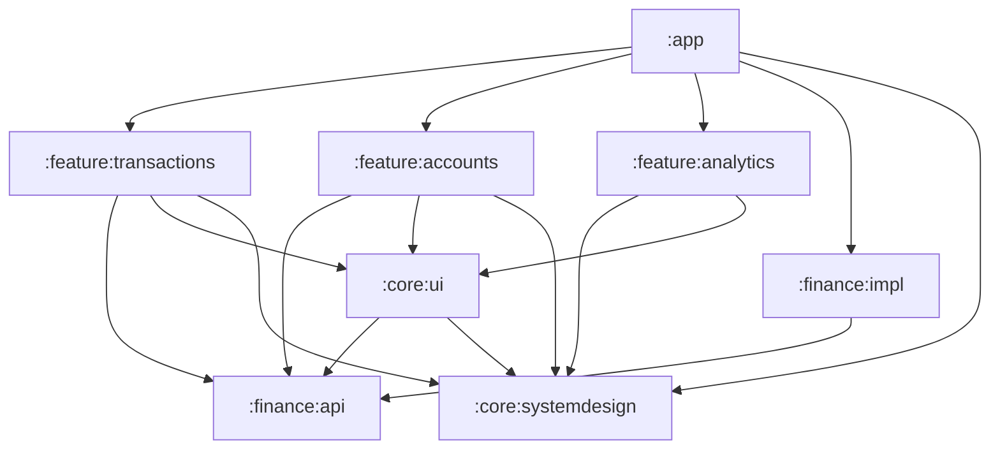
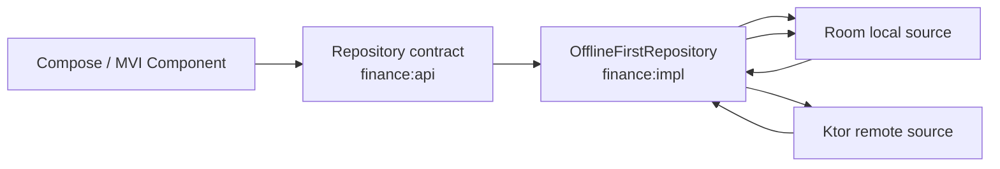
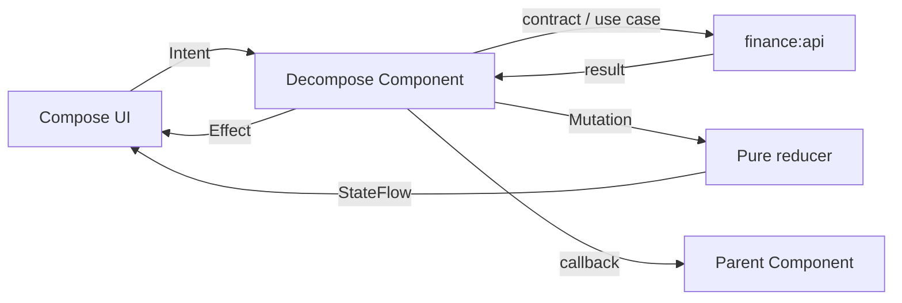

# Архитектура Ya Money

`arch.md` — архитектурный контракт проекта. Любое изменение модульных границ,
направления зависимостей, DI, навигации, MVI или слоёв данных сначала отражается
здесь с причиной решения, а затем в коде.

## 1. Текущий scope

Текущая итерация приложения содержит четыре портретных экрана:

1. список расходов;
2. список доходов;
3. список счетов.
4. экран аналитики с историей операций и фильтрами.

В эту итерацию входит получение данных по сети для счетов, расходов, доходов и
аналитики. Начинаем со списка счетов; реализация следующих экранов использует
ту же границу данных. Добавление и редактирование операций, настройки, PIN,
биометрия и Room пока не входят в scope. Архитектура оставляет для них границы,
но код «на будущее» заранее не создаётся.

Сейчас поддерживается только светлая тема. `MainActivity` зафиксирована в
portrait-ориентации; landscape-layout и тёмная палитра появятся отдельными
изменениями, когда для них появятся макеты и сценарии.

## 2. Принципы и стек

- UI — Jetpack Compose.
- Навигация и lifecycle экранных компонентов — Decompose.
- Presentation построен на собственном минимальном MVI runtime поверх
  Coroutines и Flow.
- DI пока ручной и явный. Composition root находится в `:app`.
- Разработка идёт вертикальными срезами: контракт → fake-данные → MVI Component → UI,
  а не последовательным созданием всех data-, domain- и UI-слоёв.
- Расходы и доходы — два режима одной feature `:feature:transactions`,
  параметризованной `TransactionType`.
- Список счетов — самостоятельная feature `:feature:accounts`.
- Сеть реализуется внутри `:finance:impl`: HTTP-клиент, DTO, mapper-ы и
  remote data source не пересекают границу этого модуля.
- На этапе ДЗ2 remote repository является источником данных. Room и
  offline-first появятся отдельным изменением после возникновения требования
  к офлайн-данным.
- Повторно используется визуальный каркас, но не один `HomeStore` для
  транзакций и счетов.

## 3. Модули



### `:app`

Точка входа и composition root:

- `Application`, `MainActivity` и Android manifest;
- корневая тема;
- ручной `AppDependencies`;
- `RootComponent` и `MainComponent`;
- связывание concrete-реализаций из `:finance:impl` с интерфейсами из
  `:finance:api`.

В `:app` нет бизнес-логики, DTO, Entity, DAO и реализации отдельной feature.

### `:finance:api`

Публичный Kotlin-контракт предметной области финансов. Это **не** HTTP API и не
модуль с Ktor endpoint-ами.

Содержимое:

- доменные сущности и value objects: `Money`, `CurrencyCode`, `Account`,
  `Category`, `Transaction`, типизированные ID и `TransactionType`;
- интерфейсы репозиториев;
- доменные ошибки;
- use case только для операций с собственным правилом или несколькими
  репозиториями.

Модуль не зависит от Android SDK, Compose, Decompose, DI-фреймворков, Ktor, Room и
feature-модулей. Он собран как Kotlin/JVM-модуль: не содержит Android manifest,
Android-зависимости и инструментальные Android-тесты.

Репозитории группируются по устойчивому предметному контракту, а не по экрану:
`TransactionsRepository`, `AccountsRepository`, `CategoriesRepository`. Операция,
использующая несколько сущностей, не заставляет feature импортировать другую
feature: она оформляется как use case в `:finance:api`, а реализация остаётся в
`:finance:impl`.

Для объединённой истории используется `TransactionHistoryRepository` из
`:finance:api`, а не отдельные запросы расходов и доходов в аналитической
feature. Его `getHistory()` принимает `TransactionPeriod`, по умолчанию — с
первого дня текущего месяца по текущую дату. Repository возвращает общие
domain-операции с типом, счётом, категорией, точной суммой и датой;
`RemoteTransactionHistoryRepository` получает счета один раз и объединяет
ответы истории по ним.

### `:finance:impl`

Скрывает способы получения и сохранения финансовых данных за контрактами
`:finance:api`.

Содержимое по мере появления требований:

- fake-репозитории для текущей итерации;
- repository implementations;
- remote data source, Ktor HTTP-клиент и финансовые DTO;
- финансовые DTO, Entity и mapper-ы;
- логика синхронизации и offline-first repository.

DTO, Ktor response, Room Entity, DAO и детали синхронизации не пересекают
границу `:finance:impl`.

HTTP-клиент остаётся в `:finance:impl`, пока его единственный потребитель —
финансовые remote data source. Отдельный `:core:network` не создаётся заранее:
он появится, только если транспортная инфраструктура понадобится нескольким
независимым domain implementation-модулям.

### `:core:systemdesign`

Независимая от финансовой области дизайн-система:

- цветовые токены и светлая тема;
- типографика и shapes;
- размеры и отступы;
- generic визуальные примитивы, когда у них появится минимум два потребителя.

Токены хранятся в пакете `foundation`: это базовый уровень дизайн-системы, а не
предметный слой. В нём находятся `FinanceDimensions`, палитра, типографика и
shapes. Пакет не знает о транзакциях, счетах, MVI, навигации и репозиториях.

Для элементов первого scope не допускаются случайные `dp`-литералы в feature:
размеры берутся из `FinanceDimensions`. В нём есть базовая шкала и семантические
токены для экрана, top bar, списка, FAB, bottom navigation, иконок и touch
targets. Новый устойчивый размер сначала добавляется сюда, затем применяется в
компоненте.

### `:core:ui`

Общий UI уровня финансового приложения:

- базовый MVI runtime (`MviComponent`) и контракт (`MviStore`, `MviReducer`);
- stateless layout и финансовые UI-компоненты, только если их уже используют
  минимум две feature;
- `BaseBottomSheet` — общий stateless-контейнер для выбора периода, счетов и
  категорий в аналитике. Он владеет только Material bottom-sheet, handle и
  необязательным заголовком; конкретные sheet-ы владеют своим состоянием,
  списком и обработчиками выбора;
- `SelectionListItem` — stateless-строка выбора для списков категорий, счетов
  и типа операций. Она принимает текст, необязательные emoji/подзаголовок и
  тип индикатора, но не хранит выбранные элементы;
- `UiText`, `UiError`, форматтеры денег и дат для UI.

Модуль может зависеть от `:finance:api` и `:core:systemdesign`, но не загружает
данные, не содержит MVI Component конкретного экрана и не управляет навигацией.

### `:feature:transactions`

Presentation вертикального среза транзакций:

- расход и доход как независимые экземпляры одного `TransactionsComponent`;
- MVI contract, Component, reducer, UI mapper и Compose screen;
- callbacks наружу для будущей навигации.

Вкладки расходов и доходов используют одну реализацию, но у каждой свой
экземпляр Component: сохраняются независимые дата, состояние загрузки и
позиция списка.

### `:feature:accounts`

Presentation вертикального среза счетов:

- `AccountsComponent`, собственный MVI contract, reducer и UI mapper;
- экран списка и общего баланса;
- callbacks для будущего перехода к счёту.

Feature может использовать общий stateless layout, но не Component транзакций.

### `:feature:analytics`

Presentation вертикального среза аналитики:

- `AnalyticsComponent`, MVI contract, reducer, UI mapper и Compose-экран;
- получает domain-контракт истории операций, а не DTO или HTTP-клиент;
- хранит период, тип операций, выбранные категории и счета в immutable state;
- агрегирует полученные domain-операции по категориям для диаграммы и
  отображает историю от новых операций к старым;
- содержит специализированные stateless-элементы аналитики, включая
  `AnalyticsDonutChart`. Диаграмма принимает подготовленные UI-сегменты, а не
  domain-операции; пока у неё один потребитель, она не переносится в `:core:ui`;
- преобразует загруженную историю в immutable UI-сводку до публикации State:
  применяет выбранные фильтры, считает точную сумму и группирует категории;
- публикует в State отдельно доступные варианты категорий и счетов, построенные
  из полной загруженной истории: bottom sheet фильтра остаётся рабочим даже
  если текущая комбинация фильтров не вернула операций;
- использует единую UI-модель сводной категории для диаграммы и строки
  детализации. Специфичное рисование полосы прогресса выделено в отдельный
  stateless-компонент рядом с аналитикой;
- открывает детализацию диаграммы только через MVI intent/effect: sheet получает
  уже опубликованную immutable-сводку и не обращается к репозиториям;
- назначает цвет категории детерминированно по её ID через палитру из 30
  оттенков. Цвет не приходит с backend и не зависит от порядка или фильтров;
- открывает выбор периода в два шага через MVI intent/effect: сначала
  `PeriodFilterBottomSheet` с вариантами «Произвольный», неделя, месяц,
  квартал и год, а календарь показывается только после выбора произвольного
  периода;
- использует `CalendarBottomSheet`: он оборачивает системный Material 3
  `DateRangePicker` общим `BaseBottomSheet`, хранит черновой `LocalDate`
  диапазон внутри Compose и передаёт применённые даты в экран через callback;
- переход на экран инициирует `RootComponent` из `:app`.

### Будущие core-модули

`core:common`, `core:network`, `core:database` и `core:security` не создаются
заранее. Они появляются только при конкретном потребителе и остаются
техническими:

- `core:common` — маленькие platform-agnostic утилиты, действительно нужные
  нескольким независимым модулям; не место для доменных моделей и репозиториев;
- `core:network` — только transport-инфраструктура Ktor (`HttpClient`, auth
  plugin, serialization, HTTP errors), без DTO и endpoint-методов финансов;
- `core:database` — только Room-инфраструктура (`RoomDatabase`, migrations,
  driver/configuration), без финансовых Entity и DAO;
- `core:security` — Android-обёртки для BiometricPrompt, Keystore и защищённого
  локального хранения. PIN/app-lock UI позже принадлежит feature настроек,
  а не finance.

Если такие модули будут добавлены, `:finance:impl` использует их для транспорта
и хранения, но продолжает владеть финансовыми data source, DTO/Entity и
repository implementation.

## 4. Правила зависимостей

1. `:finance:api` ни от одного project-модуля не зависит.
2. `:finance:impl` зависит от `:finance:api`, но API-контракт не знает об impl.
3. Feature зависит от `:finance:api`, а не от `:finance:impl` и другой feature.
4. `:app` — единственное место, знающее concrete implementation и собирающее
   зависимости вручную.
5. Compose не получает репозитории и не обращается к DI container/service locator.
6. DTO, Entity, DAO и UI model не являются domain model и не выходят за свои
   границы.
7. Общий компонент попадает в `:core:ui` только после двух реальных
   потребителей; до этого он живёт рядом с feature.
8. `:core:systemdesign` не зависит от finance, UI feature или навигации.
9. Зависимости передаются через конструктор. `ComponentContext`, ID экрана и
   callbacks — runtime-параметры, а не зависимости контейнера.

## 5. Данные, сеть и будущий offline-first

На этапе ДЗ2 implementation предоставляет remote-репозитории. Для счетов
`RemoteAccountsRepository` вызывает `GET /accounts`, преобразует `AccountDto`
в domain `Account` и возвращает результат через `AccountsRepository`. Compose,
feature-модули и `:finance:api` не знают об HTTP, JSON или bearer-токене.

Сетевые вызовы и тяжёлая обработка выполняются вне main thread. Component
запускает загрузку, преобразует domain-результат в mutation и публикует state;
repository отвечает за IO, HTTP-ошибки и mapping transport-моделей. Ошибки сети,
неавторизованный доступ и некорректный ответ не выходят из repository как DTO
или HTTP-исключения: они преобразуются в domain-ошибки, по которым feature
показывает Error с Retry.

Swagger предоставляет операции истории по отдельному счёту. Для аналитики с
фильтром «Все счета» repository получает список счетов и историю по каждому
выбранному счёту, затем возвращает общий набор domain-операций. Фильтрация,
сортировка и агрегация не используют сетевые модели.

После появления Room будет использована схема local source of truth:



- UI читает данные через contract, а не напрямую из Room или сети.
- Local storage — source of truth для отображения; repository публикует его
  `Flow`.
- Сеть обновляет local storage, после чего UI получает новый доменный результат.
- Стратегии конфликта, повторов, tombstone-удалений и идемпотентности появятся
  только с соответствующей серверной поддержкой. Текущий Swagger этого не
  определяет, поэтому их нельзя корректно «додумать» в первой версии.

Финансовые значения не используют `Double`/`Float`: `Money` хранит точное
числовое значение. Денежные строки API преобразуются на границе impl/API.
`emoji` — `String`, не `Char`; серверный `isIncome` превращается в
`TransactionType` на этой же границе.

История расходов и доходов запрашивается явно с domain `TransactionPeriod`.
Период по умолчанию — с первого дня текущего месяца по текущую дату; обе даты
передаются как query-параметры каждому запросу истории счёта. API предоставляет
историю только по одному счёту, поэтому remote repository сначала получает
счета, затем объединяет истории всех счетов и сортирует по `transactionDate` по
убыванию. `TransactionHistoryRepository` сохраняет тип операции на domain
границе, а `Expense` и `Income` остаются специализированными контрактами
экранов списков. Domain-операции хранят точный `occurredAt`; `occurredOn`
выводится из него для сценариев, где нужна только календарная дата.

## 6. Главный экран и навигация

```text
RootComponent (ChildStack)
|-- MainComponent (ChildStack)
|   |-- TransactionsComponent(EXPENSE)
|   |-- TransactionsComponent(INCOME)
|   `-- AccountsComponent
`-- Analytics screen
```

`RootComponent` — единственная точка навигации между основным разделом и
аналитикой. Он создаёт `MainComponent` и `AnalyticsComponent`, а от
`MainComponent` получает callback для перехода к аналитике. Пустой экран и его
Component принадлежат `:feature:analytics`; пока feature не имеет состояния и
не получает репозитории.

`MainComponent` владеет выбранной вкладкой и единственной `MainNavigationBar`.
Она не дублируется в feature-экранах. Аналитика запрашивается feature-экранами
через callback, который `MainComponent` передаёт в `RootComponent`; feature не
знают о корневой навигации. На первом этапе используется `ChildStack`: он
достаточен для статического mock-состояния расходов, доходов и счетов. Когда
вкладки начнут хранить независимые scroll position, дату или фильтры, navigation
container заменяется на `ChildPages`, сохраняющий дочерние компоненты.

Общий визуальный каркас допускается как stateless `FinanceOverviewLayout` со
слотами `header`, `summary`, `content`, `floatingActionButton`. Он не содержит
`when` по feature, MVI Component, репозитории или навигатор.

Не создаётся общий `HomeState`, содержащий одновременно `transactions` и
`accounts`: это разные области, с разными ошибками, операциями и будущими
сценариями.

## 7. Ручной DI

Пока граф небольшой, используется ручное внедрение зависимостей:

- `AppDependencies` в `:app` создаёт concrete-реализации;
- `MainActivity` передаёт зависимости в `DefaultRootComponent` через конструктор;
- `RootComponent` создаёт `MainComponent` и передаёт ему callback навигации;
- `MainComponent` передаёт repository в `DefaultExpensesComponent` через
  конструктор;
- `RootComponent` передаёт `TransactionHistoryRepository`, `AccountsRepository`
  и callback возврата в `AnalyticsComponent` через конструктор;
- MVI Component создаётся на экземпляр экрана, а не как singleton;
- Compose и domain-код не получают `AppDependencies` и не используют service
  locator.

Конфигурация remote-клиента (base URL и bearer-токен) создаётся только в
`AppDependencies` и передаётся в concrete repository/data source через
конструктор. Токен не является domain-моделью, не передаётся в feature и не
хранится в исходниках, ресурсах приложения или Git. Для локальной разработки
он берётся из неотслеживаемого `local.properties` либо переменной окружения;
для production этот источник заменяется безопасным механизмом получения и
хранения токена.

На этапе сетевой реализации граф для счетов выглядит так:

```text
AccountsRepository -> RemoteAccountsRepository -> AccountsRemoteDataSource -> HttpClient
```

Remote-реализации расходов, доходов и истории подключаются аналогично. Fake
repositories остаются допустимы для preview и изолированных тестов, но не
используются в production graph. DI-фреймворк добавляется только если ручной
composition root станет заметно сложнее.

## 8. MVI

### Контракт

```kotlin
interface State
interface Mutation
interface Intent
interface Effect

interface MviStore<I : Intent, S : State, E : Effect> {
    val state: StateFlow<S>
    val effects: Flow<E>

    fun accept(intent: I)
}

fun interface MviReducer<S : State, M : Mutation> {
    fun reduce(state: S, mutation: M): S
}
```

`MviComponent` принимает `MviReducer` и `ComponentContext`. Он создаёт два
lifecycle-aware scope: `componentScope` на `Dispatchers.Main.immediate` для
intent, публикации state и UI-effect, а также `ioScope` на `Dispatchers.IO`
для сетевых, файловых и database-операций. `ioScope` не изменяет StateFlow
напрямую: результат возвращается в `componentScope` и только там применяется
mutation. Его защищённый `reduce(state: MutableStateFlow<S>)` вызывает `MutableStateFlow.update` и
передаёт reducer текущее значение, полученное внутри атомарного update-блока.
Конкретный component реализует свой `MviStore`; базовый класс не публикует
mutable state и не навязывает транспорт effects.

- `Intent` — действие пользователя или UI-событие.
- `State` — полное immutable-состояние, достаточное для отрисовки экрана.
- `Mutation` — внутренний результат обработки, применяемый reducer-ом.
- `Effect` — одноразовое некритичное UI-действие.
- `Output` — типизированный запрос Component к родителю, обычно навигационный.

`State`, `Mutation`, `Intent` и `Effect` — marker-интерфейсы. Каждый тип
конкретного экрана явно реализует свой marker: это сохраняет границы MVI на
этапе компиляции и не допускает случайную передачу intent или state другой
feature.

Общий `BaseStore` не создаётся. `MviComponent` в `:core:ui` — минимальный
runtime для экранного Decompose-component: он связывает coroutine scope с
lifecycle и атомарно применяет mutation через чистый reducer. Он не хранит
бизнес-логику, не создаёт state сам и не знает о конкретной feature. Конкретный
component создаёт `MutableStateFlow`, публикует его как `StateFlow`, принимает
intent, вызывает repository/use case и применяет полученные mutations.

Это осознанное исключение из правила о двух потребителях для UI-компонентов:
`MviComponent` — инфраструктура presentation-слоя, а не переиспользуемый
визуальный компонент. Intent, State, Mutation, Effect и Output
конкретного экрана остаются внутри feature.

### Поток данных



### Ответственности

**MviComponent** принимает Intent, вызывает repository/use case, превращает
результаты в Mutation, сериализует обновления State и отправляет Effect/Output.
Он не содержит Composable, Android `Context`, прямую навигацию Decompose и
mutable state, доступный снаружи. Внешнему коду он предоставляет только
`StateFlow`, `Flow<Effect>` и `accept` через MVI-контракт.

**Reducer** — чистая функция `previous state + mutation -> new state`. Он не
вызывает suspend-функции, не обращается к repository и не отправляет Effect.

`MviComponent` привязывает оба scope к lifecycle Decompose; конкретный экранный
component превращает Output в callback родителя. Навигация не является Effect:
component вызывает callback, а владелец navigation container выполняет переход.

**Composable container** lifecycle-aware собирает State и Effect.
**Stateless content** принимает State и обработчик Intent; его можно вызывать в
Preview и UI-тесте без Decompose, ручного DI и MVI Component.

### State, loading и effect

- State хранит content, выбранную дату, loading/refreshing, empty и ошибку
  начальной загрузки.
- Во время refresh существующий content остаётся видимым.
- Empty — устойчивое State, не Effect.
- Ошибка отдельного действия при сохранённом content может стать
  `Effect.ShowMessage`; ошибка всего экрана — частью State с `Retry`.
- Effect доставляется без replay и не используется для критически важного
  результата.
- Ошибка обновления при сохранённом content отправляется как одноразовый
  `RetryableErrorEffect`. Общий UI-обработчик в `:core:ui` показывает Snackbar
  с действием Retry и возвращает соответствующий intent в feature. Ошибка
  начальной загрузки по-прежнему является устойчивым состоянием Error.
- При смене даты или фильтра component отменяет устаревшую загрузку, чтобы старый
  ответ не перезаписал новый State.

## 9. Структура пакетов

```text
finance/api/
  model/
  repository/
  usecase/
  error/

finance/impl/
  repository/
  fake/
  remote/        # появится с сетью
  local/         # появится с Room
  mapper/
  di/

core/systemdesign/
  foundation/
  theme/

core/ui/
  mvi/
  cmp/           # MviComponent: lifecycle и reducer runtime
  formatter/
  model/

feature/transactions/
  presentation/
    list/

feature/accounts/
  presentation/
    list/
```

Пустые `remote`, `local`, `component` и будущие core-модули не создаются только
ради структуры.

## 10. Инварианты

- Состояние immutable и имеет единственный источник записи.
- State изменяет только reducer.
- Composable отображает State и отправляет Intent.
- Side effect отсутствует в reducer и stateless UI.
- Feature не зависит от feature.
- Расходы и доходы используют один тип MVI Component с разным `TransactionType`;
  счета всегда используют отдельный MVI Component.
- Внешние data-модели не пересекают `:finance:impl`.
- Domain contract не зависит от Android и деталей хранения.
- Архитектура усложняется только вместе с конкретным требованием.
