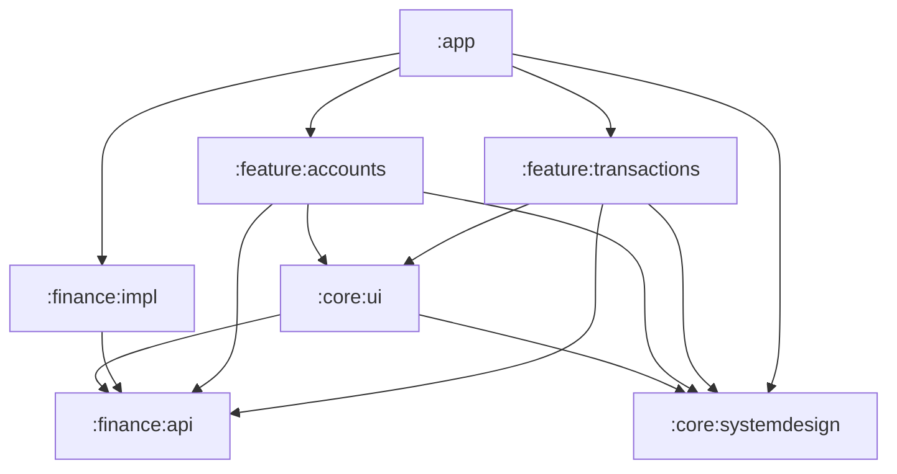
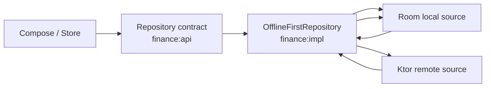
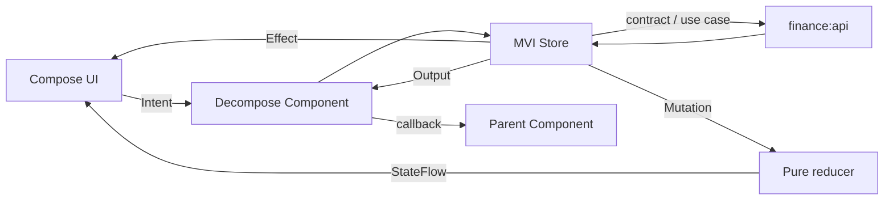

# Архитектура Ya Money

`arch.md` — архитектурный контракт проекта. Любое изменение модульных границ,
направления зависимостей, DI, навигации, MVI или слоёв данных сначала отражается
здесь с причиной решения, а затем в коде.

## 1. Текущий scope

Первая итерация приложения содержит только три портретных экрана:

1. список расходов;
2. список доходов;
3. список счетов.

Добавление, редактирование, аналитика, настройки, PIN, биометрия, сеть и Room
не входят в текущую реализацию. Архитектура оставляет для них границы, но код
«на будущее» заранее не создаётся.

Сейчас поддерживается только светлая тема. `MainActivity` зафиксирована в
portrait-ориентации; landscape-layout и тёмная палитра появятся отдельными
изменениями, когда для них появятся макеты и сценарии.

## 2. Принципы и стек

- UI — Jetpack Compose.
- Навигация и lifecycle экранных компонентов — Decompose.
- Presentation построен на собственном минимальном MVI runtime поверх
  Coroutines и Flow.
- Compile-time DI — Metro. Composition root находится в `:app`.
- Разработка идёт вертикальными срезами: контракт → fake-данные → Store → UI,
  а не последовательным созданием всех data-, domain- и UI-слоёв.
- Расходы и доходы — два режима одной feature `:feature:transactions`,
  параметризованной `TransactionType`.
- Список счетов — самостоятельная feature `:feature:accounts`.
- Повторно используется визуальный каркас, но не один `HomeStore` для
  транзакций и счетов.

## 3. Модули



### `:app`

Точка входа и composition root:

- `Application`, `MainActivity` и Android manifest;
- корневая тема;
- Metro `AppGraph`;
- `RootComponent` и `MainComponent`;
- связывание concrete-реализаций из `:finance:impl` с интерфейсами из
  `:finance:api`.

В `:app` нет бизнес-логики, DTO, Entity, DAO и реализации отдельной feature.

### `:finance:api`

Публичный Kotlin-контракт предметной области финансов. Это **не** HTTP API и не
модуль с Ktor endpoint-ами.

Содержимое:

- доменные сущности и value objects: `Money`, `CurrencyCode`, `Account`,
  `Category`, `Transaction`, типизированные ID и `TransactionType`;
- интерфейсы репозиториев;
- доменные ошибки;
- use case только для операций с собственным правилом или несколькими
  репозиториями.

Модуль не зависит от Android SDK, Compose, Decompose, Metro, Ktor, Room и
feature-модулей. Даже если Gradle-модуль временно технически собран как Android
Library, production-код в нём остаётся чистым Kotlin, чтобы модуль можно было
перевести на Kotlin/JVM без смены API.

Репозитории группируются по устойчивому предметному контракту, а не по экрану:
`TransactionsRepository`, `AccountsRepository`, `CategoriesRepository`. Операция,
использующая несколько сущностей, не заставляет feature импортировать другую
feature: она оформляется как use case в `:finance:api`, а реализация остаётся в
`:finance:impl`.

### `:finance:impl`

Скрывает способы получения и сохранения финансовых данных за контрактами
`:finance:api`.

Содержимое по мере появления требований:

- fake-репозитории для текущей итерации;
- repository implementations;
- remote и local data source;
- финансовые DTO, Entity и mapper-ы;
- логика синхронизации и offline-first repository.

DTO, Ktor response, Room Entity, DAO и детали синхронизации не пересекают
границу `:finance:impl`.

### `:core:systemdesign`

Независимая от финансовой области дизайн-система:

- цветовые токены и светлая тема;
- типографика и shapes;
- размеры и отступы;
- generic визуальные примитивы, когда у них появится минимум два потребителя.

Токены хранятся в пакете `foundation`: это базовый уровень дизайн-системы, а не
предметный слой. В нём находятся `FinanceDimensions`, палитра, типографика и
shapes. Пакет не знает о транзакциях, счетах, MVI, навигации и репозиториях.

Для элементов первого scope не допускаются случайные `dp`-литералы в feature:
размеры берутся из `FinanceDimensions`. В нём есть базовая шкала и семантические
токены для экрана, top bar, списка, FAB, bottom navigation, иконок и touch
targets. Новый устойчивый размер сначала добавляется сюда, затем применяется в
компоненте.

### `:core:ui`

Общий UI уровня финансового приложения:

- базовый контракт MVI (`MviStore`, `MviReducer`);
- stateless layout и финансовые UI-компоненты, только если их уже используют
  минимум две feature;
- `UiText`, `UiError`, форматтеры денег и дат для UI.

Модуль может зависеть от `:finance:api` и `:core:systemdesign`, но не загружает
данные, не содержит Store конкретного экрана и не управляет навигацией.

### `:feature:transactions`

Presentation вертикального среза транзакций:

- расход и доход как независимые экземпляры одного `TransactionsComponent`;
- MVI contract, Store, reducer, UI mapper и Compose screen;
- callbacks наружу для будущей навигации.

Вкладки расходов и доходов используют одну реализацию, но у каждой свой
экземпляр Component и Store: сохраняются независимые дата, состояние загрузки и
позиция списка.

### `:feature:accounts`

Presentation вертикального среза счетов:

- `AccountsComponent`, собственный MVI contract, Store, reducer и UI mapper;
- экран списка и общего баланса;
- callbacks для будущего перехода к счёту.

Feature может использовать общий stateless layout, но не Store транзакций.

### Будущие core-модули

`core:common`, `core:network`, `core:database` и `core:security` не создаются
заранее. Они появляются только при конкретном потребителе и остаются
техническими:

- `core:common` — маленькие platform-agnostic утилиты, действительно нужные
  нескольким независимым модулям; не место для доменных моделей и репозиториев;
- `core:network` — только transport-инфраструктура Ktor (`HttpClient`, auth
  plugin, serialization, HTTP errors), без DTO и endpoint-методов финансов;
- `core:database` — только Room-инфраструктура (`RoomDatabase`, migrations,
  driver/configuration), без финансовых Entity и DAO;
- `core:security` — Android-обёртки для BiometricPrompt, Keystore и защищённого
  локального хранения. PIN/app-lock UI позже принадлежит feature настроек,
  а не finance.

Если такие модули будут добавлены, `:finance:impl` использует их для транспорта
и хранения, но продолжает владеть финансовыми data source, DTO/Entity и
repository implementation.

## 4. Правила зависимостей

1. `:finance:api` ни от одного project-модуля не зависит.
2. `:finance:impl` зависит от `:finance:api`, но API-контракт не знает об impl.
3. Feature зависит от `:finance:api`, а не от `:finance:impl` и другой feature.
4. `:app` — единственное место, знающее concrete implementation и DI graph.
5. Compose не получает репозитории и не обращается к Metro/service locator.
6. DTO, Entity, DAO и UI model не являются domain model и не выходят за свои
   границы.
7. Общий компонент попадает в `:core:ui` только после двух реальных
   потребителей; до этого он живёт рядом с feature.
8. `:core:systemdesign` не зависит от finance, UI feature или навигации.
9. Зависимости передаются через конструктор. `ComponentContext`, ID экрана и
   callbacks — runtime-параметры, а не Metro bindings.

## 5. Данные и offline-first

На текущем этапе implementation предоставляет fake-репозитории. После появления
сети и Room будет использована схема local source of truth:



- UI читает данные через contract, а не напрямую из Room или сети.
- Local storage — source of truth для отображения; repository публикует его
  `Flow`.
- Сеть обновляет local storage, после чего UI получает новый доменный результат.
- Стратегии конфликта, повторов, tombstone-удалений и идемпотентности появятся
  только с соответствующей серверной поддержкой. Текущий Swagger этого не
  определяет, поэтому их нельзя корректно «додумать» в первой версии.

Финансовые значения не используют `Double`/`Float`: `Money` хранит точное
числовое значение. Денежные строки API преобразуются на границе impl/API.
`emoji` — `String`, не `Char`; серверный `isIncome` превращается в
`TransactionType` на этой же границе.

## 6. Главный экран и навигация

```text
MainComponent (ChildStack)
|-- TransactionsComponent(EXPENSE)
|-- Income placeholder
`-- Accounts placeholder
```

`MainComponent` владеет выбранной вкладкой и единственной `MainNavigationBar`.
Она не дублируется в feature-экранах. На первом этапе используется `ChildStack`:
он достаточен для статического mock-состояния расходов и пустых вкладок. Когда
вкладки начнут хранить независимые scroll position, дату или фильтры, navigation
container заменяется на `ChildPages`, сохраняющий дочерние компоненты.

Общий визуальный каркас допускается как stateless `FinanceOverviewLayout` со
слотами `header`, `summary`, `content`, `floatingActionButton`. Он не содержит
`when` по feature, Store, репозитории или навигатор.

Не создаётся общий `HomeState`, содержащий одновременно `transactions` и
`accounts`: это разные области, с разными ошибками, операциями и будущими
сценариями.

## 7. Metro

Metro используется только для compile-time построения графа:

- `:app` объявляет `AppGraph` через `@DependencyGraph`;
- `:finance:impl` предоставляет реализации repository interfaces;
- Store и Component создаются на экземпляр экрана, а не как singleton;
- scope применяется только при реальной общей lifecycle-потребности;
- Compose и domain-код не получают graph.

На текущем этапе binding-ы простые:

```text
TransactionsRepository -> FakeTransactionsRepository
AccountsRepository     -> FakeAccountsRepository
```

Переход к remote/offline-first реализации меняет Metro binding, но не API
feature и не Compose UI.

## 8. MVI

### Контракт

```kotlin
interface MviStore<Intent : Any, State : Any, Effect : Any> {
    val state: StateFlow<State>
    val effects: Flow<Effect>

    fun accept(intent: Intent)
}
```

- `Intent` — действие пользователя или UI-событие.
- `State` — полное immutable-состояние, достаточное для отрисовки экрана.
- `Mutation` — внутренний результат обработки, применяемый reducer-ом.
- `Effect` — одноразовое некритичное UI-действие.
- `Output` — типизированный запрос Component к родителю, обычно навигационный.

Общий `BaseStore` не создаётся без реально повторяющегося поведения. Базовый
контракт и чистый `MviReducer` живут в `:core:ui`; Store, Intent, State,
Mutation, Effect и Output конкретного экрана — внутри feature.

### Поток данных



### Ответственности

**Store** принимает Intent, вызывает repository/use case, превращает результаты
в Mutation, сериализует обновления State и отправляет Effect/Output. Он не
содержит Composable, Android `Context`, прямую навигацию Decompose и mutable
state, доступный снаружи.

**Reducer** — чистая функция `previous state + mutation -> new state`. Он не
вызывает suspend-функции, не обращается к repository и не отправляет Effect.

**Component** владеет Store, привязывает его scope к lifecycle Decompose,
экспортирует State/Effect/`accept` и превращает Output в callback родителя.

**Composable container** lifecycle-aware собирает State и Effect.
**Stateless content** принимает State и обработчик Intent; его можно вызывать в
Preview и UI-тесте без Decompose, Metro и Store.

Навигация не является Effect: Store создаёт Output, Component вызывает callback,
а владелец navigation container выполняет переход.

### State, loading и effect

- State хранит content, выбранную дату, loading/refreshing, empty и ошибку
  начальной загрузки.
- Во время refresh существующий content остаётся видимым.
- Empty — устойчивое State, не Effect.
- Ошибка отдельного действия при сохранённом content может стать
  `Effect.ShowMessage`; ошибка всего экрана — частью State с `Retry`.
- Effect доставляется без replay и не используется для критически важного
  результата.
- При смене даты или фильтра Store отменяет устаревшую загрузку, чтобы старый
  ответ не перезаписал новый State.

## 9. Структура пакетов

```text
finance/api/
  model/
  repository/
  usecase/
  error/

finance/impl/
  repository/
  fake/
  remote/        # появится с сетью
  local/         # появится с Room
  mapper/
  di/

core/systemdesign/
  foundation/
  theme/

core/ui/
  mvi/
  component/     # только после второго потребителя
  formatter/
  model/

feature/transactions/
  presentation/
    list/

feature/accounts/
  presentation/
    list/
```

Пустые `remote`, `local`, `component` и будущие core-модули не создаются только
ради структуры.

## 10. Инварианты

- Состояние immutable и имеет единственный источник записи.
- State изменяет только reducer.
- Composable отображает State и отправляет Intent.
- Side effect отсутствует в reducer и stateless UI.
- Feature не зависит от feature.
- Расходы и доходы используют один тип Store с разным `TransactionType`; счета
  всегда используют отдельный Store.
- Внешние data-модели не пересекают `:finance:impl`.
- Domain contract не зависит от Android и деталей хранения.
- Архитектура усложняется только вместе с конкретным требованием.
